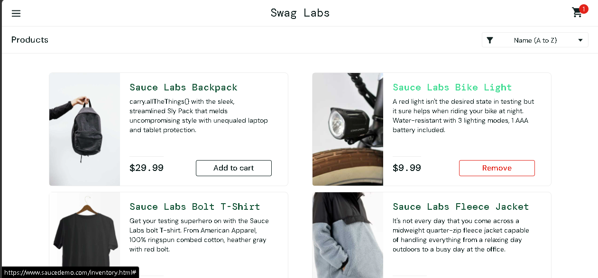
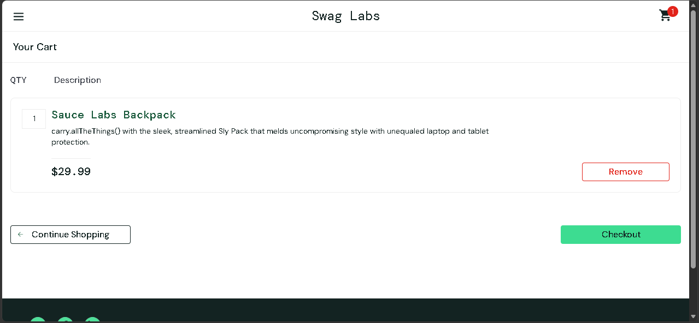
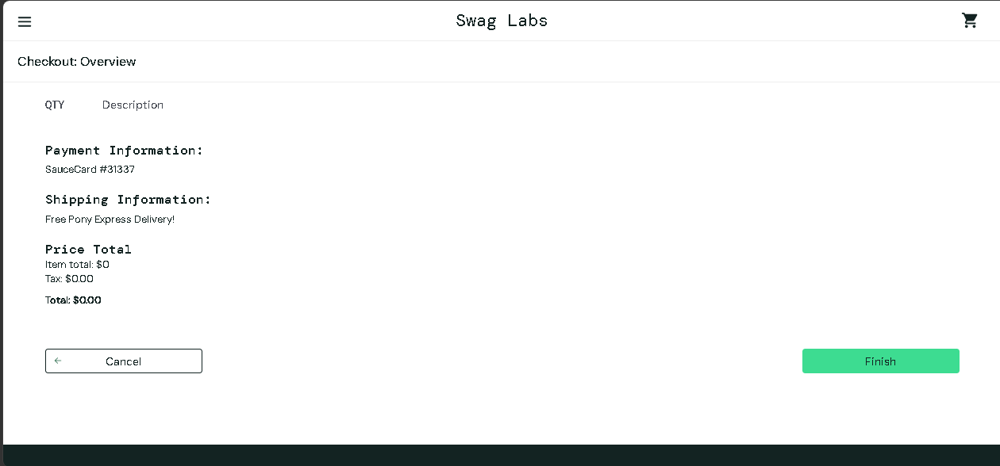

# Manual Test Cases - SauceDemo

## TC-01: Add to Cart

**Precondition:** User is logged in

### Steps:
1. Login with valid credentials
2. Click "Add to cart" on any product

**Expected Result:** Cart icon shows item count = 1  
**Actual Result:** Cart icon shows item count = 1  
**Status:** Pass  

**Evidence:**

---

## TC-02: View Cart Contents

**Precondition:** Product added to cart

### Steps:
1. Login with valid credentials
2. Click "Add to cart" on any product
3. Click cart icon

**Expected Result:** Selected product should be displayed in cart page  
**Actual Result:** Selected product is displayed in cart page  
**Status:** Pass  

**Evidence:**

---

## TC-03: Remove Item from Cart

**Precondition:** Product exists in cart

### Steps:
1. Login with valid credentials
2. Click "Add to cart" on any product
3. Click cart icon
4. Click "Remove"

**Expected Result:** Product should be removed and cart is empty  
**Actual Result:** Product is removed and cart is empty  
**Status:** Pass  

---

## TC-04: Complete Checkout Process

**Precondition:** Product is in cart

### Steps:
1. Login with valid credentials
2. Click "Add to cart" on any product
3. Click cart icon
4. Click "Checkout"
5. Enter First Name, Last Name, and Zip/Postal Code
6. Click "Continue"
7. Click "Finish"

**Expected Result:** Order confirmation page should be displayed with checkout details  
**Actual Result:** Order confirmation page is displayed along with checkout details  
**Status:** Pass  

**Evidence:**

---

## TC-05: Checkout with Empty Fields

**Precondition:** Product is in cart

### Steps:
1. Login with valid credentials
2. Click "Add to cart" on any product
3. Click cart icon
4. Click "Checkout"
5. Leave First Name, Last Name, and Zip/Postal Code fields empty
6. Click "Continue"

**Expected Result:** Validation error message should be shown  
**Actual Result:** Validation error message is shown  
**Status:** Pass  

---

## TC-06: Checkout with Empty Cart

**Precondition:** Cart is empty

### Steps:
1. Login with valid credentials
2. Click cart icon
3. Click "Checkout"
4. Enter First Name, Last Name, and Zip/Postal Code
5. Click "Continue"
6. Click "Finish"

**Expected Result:** Checkout should be prevented by the system and display a message indicating the cart is empty  
**Actual Result:** Checkout proceeds even with an empty cart  
**Status:** Fail  

**Evidence:**

